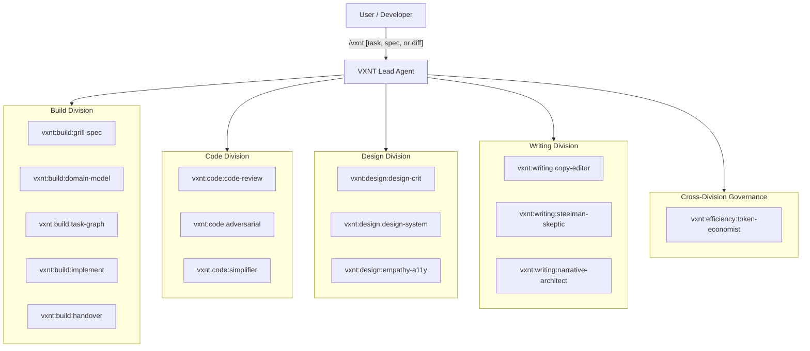

# VXNT: Dedicated Workflow Agent & Skill System

A model-agnostic, harness-agnostic system featuring **VXNT** (Dedicated Lead Agent), 4 specialized **Division Subagents**, and 15 skills prefixed with `vxnt:` across **Build**, **Code**, **Design**, **Writing**, and **Token Efficiency**.

Runs natively in **Google Antigravity**, **Claude Code**, **Cursor**, **Windsurf**, or directly inside web chats and API wrappers (Claude, GPT-4o, Gemini, DeepSeek, Ollama).

---

## 👑 The Dedicated Lead Agent: `VXNT`

Instead of just a loose bag of tools, this system is anchored by a dedicated Lead Agent: [`skills/vxnt/SKILL.md`](skills/vxnt/SKILL.md) and governed by [`AGENTS.md`](AGENTS.md) and [`CORE.md`](CORE.md).

- **Role:** Principal Architect, Design Director, Chief Editor, and Build Engine.
- **Trigger:** `/vxnt`, `@vxnt`, or *"ask vxnt"*.
- **Authority:** Evaluates the problem holistically, dynamically summons the 4 divisions, and executes the multi-agent Gauntlet & Build Pipeline recipes.



---

## 🤖 The Division Subagents

For task-specific delegation in harnesses that support subagents (e.g. Antigravity, Cursor):

| Subagent ID | Focus Area | File Spec |
| :--- | :--- | :--- |
| **`vxnt-build`** | Requirements grilling, domain modeling, DAG task plans, dual-gate implementation, and handover | [`.agents/agents/vxnt-build.md`](.agents/agents/vxnt-build.md) |
| **`vxnt-code`** | Code architecture, red-team hardening, and simplification | [`.agents/agents/vxnt-code.md`](.agents/agents/vxnt-code.md) |
| **`vxnt-design`** | Visual hierarchy, WCAG 2.2 AA accessibility, and token enforcement | [`.agents/agents/vxnt-design.md`](.agents/agents/vxnt-design.md) |
| **`vxnt-writing`** | Ruthless copy editing, argument steelmanning, and narrative outlines | [`.agents/agents/vxnt-writing.md`](.agents/agents/vxnt-writing.md) |
| **`vxnt`** | Principal orchestrator coordinating all divisions | [`.agents/agents/vxnt.md`](.agents/agents/vxnt.md) |

---

## 🧭 The 15 Linked Specialist Skills (`vxnt:*`)

All skills follow the lean standard defined in [`CORE.md`](CORE.md) (~50% leaner, zero duplicate boilerplate):

| Division | Skill ID & Spec Link | Role & Specialty | Key Lens |
| :--- | :--- | :--- | :--- |
| **Build** | [`vxnt:build:grill-spec`](skills/vxnt:build:grill-spec/SKILL.md) | Requirement Inquisitor | Zero-tolerance interrogation, non-goals, failure states, RFCs |
| **Build** | [`vxnt:build:domain-model`](skills/vxnt:build:domain-model/SKILL.md) | Strategic DDD Modeler | Ubiquitous language, entities, value objects, invariants, states |
| **Build** | [`vxnt:build:task-graph`](skills/vxnt:build:task-graph/SKILL.md) | Transient DAG Decomposer | Vertical slices, `blocked_by` graphs, LOCAL/REMOTE tracking |
| **Build** | [`vxnt:build:implement`](skills/vxnt:build:implement/SKILL.md) | Incremental Craftsman | ACTIVE live surface gates vs AFK 3-strike circuit breaker |
| **Build** | [`vxnt:build:handover`](skills/vxnt:build:handover/SKILL.md) | Continuity Governor & Archiver | `.tasks/HANDOVER.md` checkpoints, master doc archival & cleanup |
| **Code** | [`vxnt:code:code-review`](skills/vxnt:code:code-review/SKILL.md) | Architecture & Quality Gatekeeper | Module depth, seams, cognitive load, error resilience |
| **Code** | [`vxnt:code:adversarial`](skills/vxnt:code:adversarial/SKILL.md) | Doubt-Driven Red Teamer | Concurrency, race conditions, toxic inputs, failure cascades |
| **Code** | [`vxnt:code:simplifier`](skills/vxnt:code:simplifier/SKILL.md) | YAGNI & Bloat Eliminator | Dead code, premature abstractions, native stdlib leverage |
| **Design** | [`vxnt:design:design-crit`](skills/vxnt:design:design-crit/SKILL.md) | Visual & Interaction Critic | Visual hierarchy, 4px/8px rhythm, typography, affordances |
| **Design** | [`vxnt:design:design-system`](skills/vxnt:design:design-system/SKILL.md) | Token & Component Hygiene Enforcer | Zero hardcoded values, component reusability, semantic HTML |
| **Design** | [`vxnt:design:empathy-a11y`](skills/vxnt:design:empathy-a11y/SKILL.md) | Cognitive Strain & A11y Auditor | WCAG 2.2 AA/AAA, keyboard focus, screen readers, edge states |
| **Writing** | [`vxnt:writing:copy-editor`](skills/vxnt:writing:copy-editor/SKILL.md) | Ruthless Slop-Cutter & Stylist | Purges AI clichés, active verbs, dynamic cadence, 30%+ cut |
| **Writing** | [`vxnt:writing:steelman-skeptic`](skills/vxnt:writing:steelman-skeptic/SKILL.md) | Thesis Challenger & Logic Auditor | Exposes unstated assumptions, attacks weak logic, steelmans |
| **Writing** | [`vxnt:writing:narrative-architect`](skills/vxnt:writing:narrative-architect/SKILL.md) | Information Architect & Pacing Strategist | Outlines, cognitive progression (familiar -> novel), payoffs |
| **Efficiency**| [`vxnt:efficiency:token-economist`](skills/vxnt:efficiency:token-economist/SKILL.md) | Cross-Division Token Governor | Prunes context noise, enforces terse diffs, aligns prompt cache |

---

## ⚡ Dual-Mode Execution

Every agent and skill supports two operational modes:

### 1. Fast Audit / Active Mode (Default)
Feed an artifact (diff, component code, PRD, or task). It immediately returns:
- **Executive Verdict** (`PASS`, `NEEDS_WORK`, or `REJECT`)
- **Quality Scorecard Matrix** (1-5 ratings across domain dimensions)
- **Ranked Findings** (`BLOCKER`, `WARNING`, `NIT/POLISH`) with problem analysis and **concrete drop-in replacement diffs**
- **Verification Runbook & Surface:** Concrete CLI command, URL, or curl snippet for live verification.

### 2. Workshop / AFK Mode
- **Workshop Mode:** Triggered during exploratory phases (e.g., *"Spar with me on this architecture"* or *"Let's workshop this opening paragraph"*). The agent acts as a dialectic sparring partner.
- **AFK Mode (Autonomous Execution):** Executes DAG tasks autonomously with deterministic test verification and a strict 3-attempt circuit breaker before halting.

---

## 🛡️ Multi-Agent Recipes & Pipelines

Full recipes and single-prompt templates live in [`recipes/`](recipes/):

| Recipe | Sequence & Recipe Link | Best For | Quick Trigger Example |
| :--- | :--- | :--- | :--- |
| **Build Pipeline** | [`recipes/build-pipeline.md`](recipes/build-pipeline.md)<br>`vxnt:build:grill-spec` ➔ `vxnt:build:domain-model` ➔ `vxnt:build:task-graph` ➔ `vxnt:build:implement` ➔ `vxnt:build:handover` | Product ideas, new features, and end-to-end implementations | `/vxnt run build pipeline on feature-idea`<br>*(or ask `vxnt-build`)* |
| **Code Gauntlet** | [`recipes/code-gauntlet.md`](recipes/code-gauntlet.md)<br>`vxnt:code:code-review` ➔ `vxnt:code:adversarial` ➔ `vxnt:code:simplifier` | Pull requests, critical backend modules, refactors | `/vxnt run code gauntlet on src/auth.ts`<br>*(or ask `vxnt-code`)* |
| **Design Gauntlet** | [`recipes/design-gauntlet.md`](recipes/design-gauntlet.md)<br>`vxnt:design:design-crit` ➔ `vxnt:design:empathy-a11y` ➔ `vxnt:design:design-system` | New UI components, modals, responsive screens | `/vxnt run design gauntlet on components/Modal.tsx`<br>*(or ask `vxnt-design`)* |
| **Writing Gauntlet** | [`recipes/writing-gauntlet.md`](recipes/writing-gauntlet.md)<br>`vxnt:writing:narrative-architect` ➔ `vxnt:writing:copy-editor` ➔ `vxnt:writing:steelman-skeptic` | PRDs, RFCs, blog posts, strategic pitches | `/vxnt run writing gauntlet on docs/rfc.md`<br>*(or ask `vxnt-writing`)* |

### How to Run Recipes:
1. **Interactive Lead Agent:** Mention `/vxnt run the <build|code|design|writing> pipeline on <target>`. VXNT will orchestrate the passes and synthesize findings.
2. **Dedicated Division Subagent:** Tell `vxnt-build`, `vxnt-code`, `vxnt-design`, or `vxnt-writing` to run the recipe.
3. **Step-by-Step Manual Execution:** Run the individual slash commands sequentially.
4. **Single-Prompt Web LLMs:** Copy the pre-built `Automated Gauntlet / Pipeline Prompt` from the bottom of any recipe file into ChatGPT, Claude.ai, or Gemini Studio.

---

## 🚀 Cross-Harness Installation

Use the included zero-dependency installer script to link or export agents:

```bash
# Interactive setup
./scripts/install.sh

# Target specific harness:
./scripts/install.sh --target antigravity   # Installs as unified plugin in ~/.gemini/config/plugins/vxnt
./scripts/install.sh --target claude        # Skills to ~/.claude/skills/ (or .claude-plugin/)
./scripts/install.sh --target cursor        # Generates .cursor/rules/ (subagent personas @vxnt-* & skills)
./scripts/install.sh --target bundle        # Builds dist/all-agents-bundle.md
./scripts/install.sh --target all           # Installs across all supported harnesses

# Uninstall:
./scripts/install.sh --target antigravity --uninstall
```

### Using with Web LLMs (ChatGPT, Claude.ai, Gemini Studio, Ollama)
Run `./scripts/export-bundle.sh` to generate [`dist/all-agents-bundle.md`](dist/all-agents-bundle.md). Copy and paste any agent's specification directly into your model's system prompt or chat session.

---

## 📄 License
MIT
