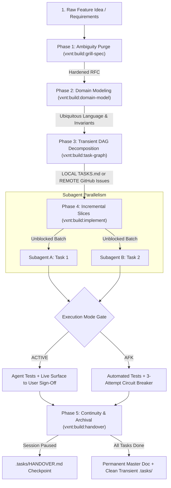

# The Product-to-Code Build Pipeline Recipe

> **Composite Multi-Agent Workflow:** `vxnt:build:grill-spec` ➔ `vxnt:build:domain-model` ➔ `vxnt:build:task-graph` ➔ `vxnt:build:implement` ➔ `vxnt:build:handover`  
> **Target:** Product Ideas, Feature Requests, Architectural Refactors, and Greenfield Implementations.  
> **Orchestrator:** Subagent `vxnt-build` or Lead Agent `VXNT`.

---

## Workflow Objective

The **Build Pipeline** transforms raw, ambiguous product ideas into production code through five disciplined phases:



---

## Token Efficiency Directive (`vxnt:efficiency:token-economist`)
> **Context Boundary:** Do not pass the full transcripts of grilling or domain modeling into task implementation. Pass only the **Functional RFC**, the **Domain Invariant Table**, and the **Active Task Surface Runbook**.

---

## Phase-by-Phase Invocation Protocol

### Phase 1: Requirements Dissection (`vxnt:build:grill-spec`)
Interrogate the feature request until all ambiguity, implicit behavior, and hand-waving are eradicated. Questions are asked strictly **one by one**, interactively in the terminal with multiple-choice options and custom write-in answers:
```
/vxnt:build:grill-spec
Feature: [Describe feature idea or requirements]
```
*Deliverable:* Functional RFC with explicit non-goals, boundary conditions, and acceptance criteria.

### Phase 2: Domain Modeling (`vxnt:build:domain-model`)
Formalize ubiquitous language, aggregate roots, entities, value objects, and invariant state transitions:
```
/vxnt:build:domain-model
Input: [Functional RFC from Phase 1]
```
*Deliverable:* Domain Model Specification with ubiquitous glossary, aggregate transaction boundaries, and state transition matrices.

### Phase 3: Transient Task DAG Breakdown (`vxnt:build:task-graph`)
Decompose the domain model into vertical thin slices with explicit `blocked_by` dependencies:
```
/vxnt:build:task-graph --mode=local    # Uses transient .tasks/TASKS.md
# OR
/vxnt:build:task-graph --mode=remote   # Uses GitHub Issues (auto-initializes git if needed)
```
*Deliverable:* Transient Task Graph with parallel execution batches and surface verification runbooks.

### Phase 4: Incremental Implementation (`vxnt:build:implement`)
Execute the unblocked tasks using the chosen gate mode:
- **ACTIVE Mode (Human-in-the-Loop):**
  ```
  /vxnt:build:implement --mode=active --task=T1
  ```
  *Gate:* Runs essential tests, serves the live testable surface (CLI command, preview URL, or curl recipe), and pauses for user sign-off (`OK` or feedback).
- **AFK Mode (Autonomous Execution):**
  ```
  /vxnt:build:implement --mode=afk
  ```
  *Gate:* Executes continuously across unblocked tasks, verifying with deterministic test suites. Trips the 3-attempt circuit breaker and halts if a test fails 3 consecutive times.
- **Parallel Subagents:** Independent tasks in the same batch are dispatched concurrently to separate subagents (`invoke_subagent`).

### Phase 5: Session Continuity & Archival (`vxnt:build:handover`)
- **If Interrupted / Context Saturated:**
  ```
  /vxnt:build:handover checkpoint
  ```
  *Checkpoint:* Writes `.tasks/HANDOVER.md` capturing active task, DAG progress, git status, and next verification command. Successor agents resume instantly with `/vxnt:build:handover resume`.
- **When All Tasks Complete:**
  ```
  /vxnt:build:handover archive
  ```
  *Archival:* Consolidates domain model, architectural decisions, and verification receipts into `docs/<feature>.md` (or `CONTEXT.md`), then permanently deletes transient `.tasks/` files (and closes GitHub Issues with summary).

---

## Single-Prompt LLM Execution Prompt

For non-agentic LLMs or single-window web prompts:

```markdown
Execute the **Product-to-Code Build Pipeline** for the following product request:

PHASE 1 - AMBIGUITY PURGE (grill-spec):
- Interrogate the requirements. Eliminate vagueness, define non-goals, and establish edge-case behavior.

PHASE 2 - DOMAIN MODEL (domain-model):
- Define Ubiquitous Language, Aggregate Roots, Entities, Value Objects, and state transition invariants.

PHASE 3 - TRANSIENT TASK GRAPH (task-graph):
- Break down the implementation into a DAG of vertical slices (T1, T2, ...).
- Mark explicit `blocked_by` dependencies and parallel execution batches.

PHASE 4 - INCREMENTAL SLICE (implement):
- Implement the first unblocked slice (T1).
- Provide essential tests and a concrete testable surface runbook (CLI command, curl, or preview URL).

FEATURE REQUEST:
<paste feature description here>
```
