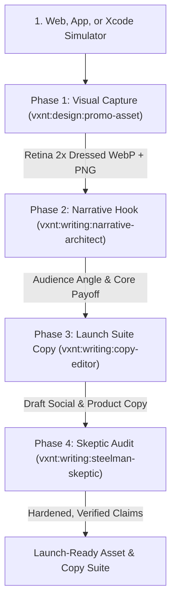

# The Promotional Asset & Copy Gauntlet Recipe

> **Composite Multi-Agent Workflow:** `vxnt:design:promo-asset` ➔ `vxnt:writing:narrative-architect` ➔ `vxnt:writing:copy-editor` ➔ `vxnt:writing:steelman-skeptic`  
> **Target:** Web and app product launches, feature announcements, social media showcases, Product Hunt campaigns, and landing page banners.  
> **Orchestrator:** Lead Agent `VXNT` or Division Subagents (`vxnt-design`, `vxnt-writing`).

---

## Workflow Objective

The **Promo Gauntlet** pairs high-precision visual capture with sharp, unignorable promotional copy:
1. **Phase 1: Visual Asset Generation (`vxnt:design:promo-asset`):** Automatically finds the best point of interest (POI), captures at Retina 2x resolution, applies dressed promotional framing, and exports compressed WebP + high-res PNG.
2. **Phase 2: Narrative Hook & Angle (`vxnt:writing:narrative-architect`):** Dissects the captured feature, establishes target audience psychology, and builds the problem ➔ novelty ➔ payoff narrative arc.
3. **Phase 3: Launch Suite Copywriting (`vxnt:writing:copy-editor`):** Drafts punchy, fluff-free copy for X/Twitter, LinkedIn, Product Hunt, and hero banners.
4. **Phase 4: Skeptic Reality Check (`vxnt:writing:steelman-skeptic`):** Cross-examines marketing claims against what the screenshot actually proves, purging hyperbole and verifying credibility.



---

## Token Efficiency Directive (`vxnt:efficiency:token-economist`)
> **Context Control:** Do not pass binary image data or raw HTML into the writing agents. Pass only the asset metadata (dimensions, captured element title, and visual summary) alongside the feature value proposition.

---

## Step-by-Step Invocation Protocol

### Phase 1: Visual Asset Generation (`vxnt:design:promo-asset`)
Capture the feature from your local dev server, live URL, or running Xcode Simulator:
```bash
# Web / Dev Server
/vxnt:design:promo-asset
Target: [Local dev server or URL, e.g. http://localhost:3000]
Preset: og (1200x630) | producthunt (1270x760) | square

# Xcode Simulator (iOS/iPadOS)
/vxnt:design:promo-asset --simulator
Preset: og (1200x630) | square (1080x1080) | raw
```
*Deliverable:* Retina 2x dressed WebP (<200KB) and high-res PNG saved to `./assets/promo/`.

### Phase 2: Narrative Hook & Positioning (`vxnt:writing:narrative-architect`)
Analyze the visual asset and formulate the core angle:
```bash
/vxnt:writing:narrative-architect
Feature: [Describe feature shown in screenshot]
Target Audience: [Developers, Designers, End-users]
Outcome: [Core pain point relieved]
```
*Deliverable:* Core narrative hook, customer empathy angle, and feature positioning.

### Phase 3: Comprehensive Launch Suite Copy (`vxnt:writing:copy-editor`)
Generate punchy, high-converting copy tailored to the captured asset:
```bash
/vxnt:writing:copy-editor
Input: [Narrative hook and asset context from Phase 2]
```
*Deliverable:*
1. **X / Twitter Launch Post:** Hook sentence, 2 bullet points, CTA, and 3-tweet follow-up thread skeleton.
2. **LinkedIn Announcement:** Clean story format highlighting the problem, the solution, and behind-the-scenes engineering trade-off.
3. **Product Hunt Campaign:** Tagline (max 60 chars) + punchy 3-paragraph product description.
4. **Website Hero Banner:** H1 headline (under 8 words) + H2 subhead (under 20 words).

### Phase 4: Reality Check & Skeptic Audit (`vxnt:writing:steelman-skeptic`)
Stress-test the marketing copy against the visual evidence:
```bash
/vxnt:writing:steelman-skeptic
Input: [Draft Launch Suite copy + Screenshot description]
```
*Goal:* Purge overpromising buzzwords ("revolutionary", "game-changing", "seamless"). Align claims with what is demonstrable in the UI.

---

## Automated Gauntlet Prompt (For Single-Prompt LLM Execution)

Copy and paste this into ChatGPT, Claude.ai, or Gemini Studio when running in a single web prompt:

```markdown
Run the **Promo Gauntlet** on the following web/app feature. Execute four disciplined passes:

PASS 1 - VISUAL ASSET DIRECTIVE (promo-asset):
- Identify the primary visual Point of Interest (hero card, pricing table, interactive widget).
- Recommend framing canvas preset (OG 1200x630 or Product Hunt 1270x760), theme (dark gradient or mesh), and Retina 2x export.

PASS 2 - NARRATIVE HOOK & POSITIONING (narrative-architect):
- Determine target audience, primary user struggle, and core emotional payoff.
- Structure the hook so the value is understood in under 3 seconds.

PASS 3 - LAUNCH SUITE COPYWRITING (copy-editor):
- Draft an X/Twitter post + 3-tweet thread hook.
- Draft a LinkedIn product announcement post.
- Draft a Product Hunt tagline (<=60 chars) + short description.
- Draft a website hero banner (H1 + H2).
- Enforce active voice, tight cadence, and zero corporate fluff.

PASS 4 - SKEPTIC REALITY CHECK (steelman-skeptic):
- Attack exaggerated claims; eliminate unearned buzzwords ("effortless", "seamless", "ultimate").
- Ensure every claim is backed up by verifiable UI features.

---
PRODUCT / FEATURE DESCRIPTION:
<describe feature, local preview URL, or paste UI text here>
```
