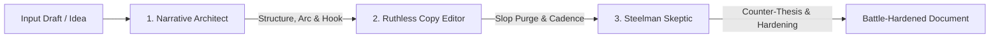

# The Writing Gauntlet Recipe

> **Composite Multi-Agent Workflow:** `narrative-architect` ➔ `copy-editor` ➔ `steelman-skeptic`  
> **Target:** PRDs, Technical Specs, Manifestos, Documentation, Blog Posts, Strategy Memos.

---

## Workflow Objective
The Writing Gauntlet elevates technical and strategic writing from rough thoughts to an undeniable, high-density, battle-hardened document:
1. **Tier 1 (`narrative-architect`):** Structures the outline, cognitive progression (familiar -> novel), hook, and pacing.
2. **Tier 2 (`copy-editor`):** Purges AI slop, cuts fluff by 30-50%, eliminates passive voice, and tightens rhythm.
3. **Tier 3 (`steelman-skeptic`):** Attacks the sharpened draft with the strongest possible counterarguments and exposes unstated premises.



---

## Step-by-Step Invocation Protocol

### Step 1: Structural & Narrative Blueprint
Run `narrative-architect` on the initial concept or rough draft:
```
/narrative-architect
<paste draft or outline>
```
*Goal:* Reorder sections to avoid burying the lede, set up clear cognitive progression, and establish the hook.

### Step 2: Ruthless Copy Edit & Slop Purge
Pass the re-structured draft to `copy-editor`:
```
/copy-editor
<paste structured draft>
```
*Goal:* Eradicate "delve", "tapestry", passive constructions, and wordy filler. Maximize signal density.

### Step 3: Steelman Adversarial Challenge
Pass the tightened prose to `steelman-skeptic`:
```
/steelman-skeptic
<paste tightened draft>
```
*Goal:* Attack the core thesis with the smartest counterarguments. Identify missing evidence and qualify claims so the document is unassailable.

---

## Automated Gauntlet Prompt (For Single-Prompt LLM Execution)

If running in a single web prompt or non-agentic LLM, paste this prompt:

```markdown
Run the **Writing Gauntlet** on the following draft. Execute three passes in order:

PASS 1 - NARRATIVE & INFORMATION ARCHITECTURE (narrative-architect):
- Evaluate hook strength, cognitive flow, and scannability.
- Re-sequence sections so the core insight is immediately prominent.

PASS 2 - RUTHLESS COPY EDIT (copy-editor):
- Purge all AI clichés, corporate jargon, and throat-clearing intros.
- Cut word count by 30%+ while preserving 100% of the core signal.
- Ensure dynamic sentence cadence and strong active verbs.

PASS 3 - STEELMAN ADVERSARIAL CHALLENGE (steelman-skeptic):
- Attack the argument using the strongest possible counter-thesis.
- Identify unstated assumptions, logical leaps, and missing proof.
- Add qualifications and defenses to make the thesis bulletproof.

FINAL DELIVERABLE:
1. Combined Editorial Scorecard Matrix.
2. The final, tightened, and hardened document.

---
DRAFT TO REVIEW:
<paste your draft here>
```
